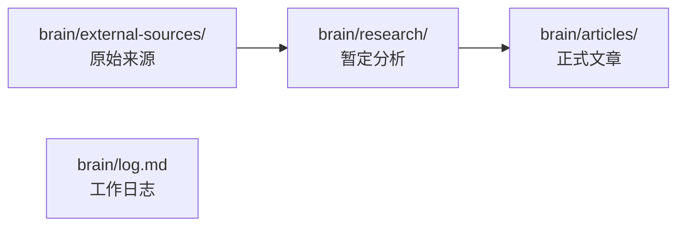

# OpenKnowledge 怎么用

> [!NOTE]
> 本文从当前仓库实况整理，回答「项目结构是什么、怎么用」。属于 `research/` 层的暂定说明，不是 `articles/` 里的正式定稿。

## 一句话：OpenKnowledge 是什么

OpenKnowledge（OK）是一套用 Markdown 写的知识库：人和 AI Agent 通过 MCP 协作读写，改动会实时同步到预览编辑器，并保留版本与链接关系。

你现在打开的这个仓库，内容根目录就是项目根（`content.dir = .`），正文主要在 `brain/` 下（见工作日志 [`brain/log.md`](../log.md)）。

## 项目结构（本仓库）

| 路径 | 作用 |
| --- | --- |
| `brain/external-sources/` | **原始来源层**：URL/PDF/文件按原文保存，带 `source_url` 与抓取日期。由 `ingest` 产出，抓完后当不可变引用，不做分析。 |
| `brain/research/`（本文所在） | **研究层**：综合来源写暂定结论；事实声明要链回 `external-sources/`；`status: provisional`。 |
| `brain/articles/`（现有草稿见 [`Untitled`](../articles/Untitled.md)） | **定稿层**：团队拍板后的权威文章；可带 `supersedes:` 指回被取代的 research。 |
| [`brain/log.md`](../log.md) | **工作日志**：每次改知识库追加一条日期记录。 |
| `.ok/` | OK 运行时配置、技能等（内部状态；不要手改当普通文档）。 |

三层是有意分开的：**先 ingest 留证据 → 再 research 写判断 → 再 consolidate 成文章**。

## 你怎么用（日常）

### 1. 在 Cursor 里跟 Agent 说话

直接用自然语言即可，例如：

- 「把这个链接 ingest 进知识库」
- 「research 一下 XXX，写进 research/」
- 「打开某篇文档的预览」

Agent 会走 OpenKnowledge MCP（`exec` / `search` / `write` / `edit` 等），而不是直接改磁盘上的 `.md`——这样预览、版本和协作归因才正确。

### 2. 看预览 / 编辑器

右侧 Web 预览就是 OK 编辑器。Agent 可用 `preview_url` 打开某篇文档；你也可以在预览里浏览、编辑。改动能通过 CRDT 同步。

### 3. 四条常用工作流

| 你想做的事 | 对应 workflow |
| --- | --- |
| 保存一篇网页/PDF 原文 | `ingest` → 落到 `external-sources/` |
| 调查某个问题、综合多源 | `research` → 落到 `research/` |
| 结论已定，写成权威条目 | `consolidate` → 落到 `articles/` |
| 仓库已有内容、想理清约定 | `discover` |

### 4. 写文档时的硬规矩（摘要）

- 每篇要有 frontmatter：至少 `title`、`description`
- 事实要有来源；外链应先 `ingest` 成本地文档，再链本地路径
- 用标准 Markdown 链接互相引用：`[标题](./相对路径.md)`
- 写之前先看目标文件夹（有没有模板、文件夹约定）

## 最小上手路径

1. 打开预览，随便点进 `brain/` 下某一层看文件夹说明
2. 丢给 Agent 一个你想保存的 URL：「请 ingest」
3. 再问：「基于刚 ingest 的来源，research XXX」
4. 觉得结论够稳了：「consolidate 成文章」

## 开放问题

- 是否要把本文晋升为 `articles/` 正式入门页？（需你确认后再 consolidate）
