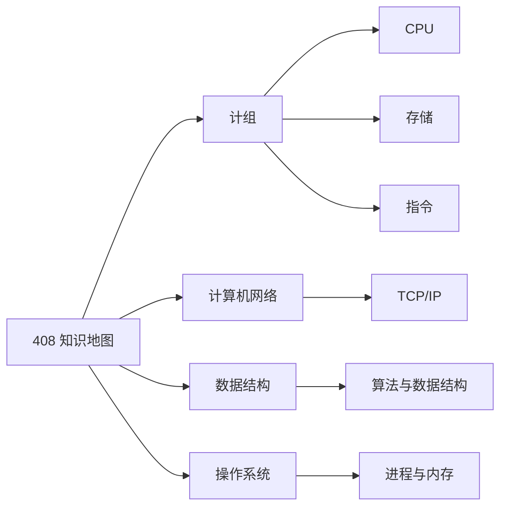

# 408 知识地图

> [!TIP]
> 从 Obsidian 迁入后已按 OK 路径链接整理，并补了复习提纲/对照表/自检。
> **vault 落库规则**：按考纲叶子全覆盖；已有正文只追加不删；每批需验证。见 [覆盖矩阵](../../brain/research/408-syllabus/vault-coverage.md)。

## 数据结构（vault）

- [数据结构目录](./数据结构/00-目录.md)

## 操作系统（vault）

- [操作系统目录](./操作系统/00-目录.md)

## 计算机网络（vault）

- [计算机网络目录](./计算机网络/00-目录.md)

## 四科一体化主文件

- [408 考纲流水线](../../brain/research/408-syllabus-pipeline.md)
- [唯一考纲原文（新东方2026转载）](../../brain/external-sources/408-syllabus-xdf-2026-derivative.md)
- [数据结构：考纲、知识深化、易错点与练习](../../brain/research/408-syllabus/data-structures.md)
- [计算机组成原理：考纲、知识深化、易错点与练习](../../brain/research/408-syllabus/computer-organization.md)
- [操作系统：考纲、知识深化、易错点与练习](../../brain/research/408-syllabus/operating-systems.md)
- [计算机网络：考纲、知识深化、易错点与练习](../../brain/research/408-syllabus/computer-networks.md)

## 计组（vault 目录）

- [计组目录](计算机组成原理/00-目录.md)

## 计算机组成原理（计组）

### CPU
- [功能与结构](计算机组成原理/CPU/功能与结构.md)
- [微程序控制器](计算机组成原理/CPU/微程序控制器.md)

### 存储系统
- [存储系统基本概念](计算机组成原理/存储系统/存储系统基本概念.md)
- [SRAM 与 DRAM](计算机组成原理/存储系统/SRAM与DRAM.md)
- [ROM 与 RAM](计算机组成原理/存储系统/ROM与RAM.md)
- [Cache](计算机组成原理/存储系统/Cache.md)
- [辅存](计算机组成原理/存储系统/辅存.md)

### 指令结构
- [指令](计算机组成原理/指令结构/指令.md)
- [RISC 与 CISC](计算机组成原理/指令结构/RISC,CISC.md)
- [汇编指令](计算机组成原理/指令结构/汇编指令.md)
- [机器语言](计算机组成原理/指令结构/机器语言.md)
- [函数调用](计算机组成原理/指令结构/函数调用.md)

### 输入输出
- [输入输出系统](计算机组成原理/输入输出/输入输出.md)
- [显示器、色深与显存](计算机组成原理/输入输出/显示器与显存.md)
- [USB 统一外设接口](计算机组成原理/输入输出/USB.md)

### 其它
- [总线](计算机组成原理/总线/总线.md)
- [逻辑数字运算](计算机组成原理/逻辑数字运算.md)

## 计算机网络
- [应用层](./计算机网络/应用层.md)
- [编码方式](./计算机网络/编码方式.md)

## 数据结构
- [线性表](./数据结构/线性表/线性表.md)
- [数组](./数据结构/线性表/数组.md)

## 操作系统

- [操作系统概述](./操作系统/概述.md)
- [进程管理](./操作系统/进程管理.md)
- [内存管理](./操作系统/内存管理.md)
- [文件管理](./操作系统/文件管理.md)
- [输入输出管理](./操作系统/输入输出管理.md)

