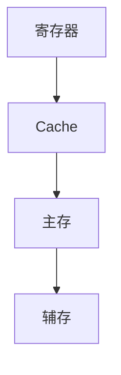

# 存储系统基本概念

> [!abstract] 一句话
> 用**层次结构**换「快又大又便宜」：寄存器→Cache→主存→辅存；指标看带宽、周期、容量与延迟。

## 层次化结构

[存储层次 Excalidraw 存档](附件/存储系统基本概念%202026-07-01%2017.08.39.excalidraw.md)

## 存储介质

- **半导体**：主存、Cache、固态硬盘
- **光 / 磁**：磁盘也叫机械硬盘；光盘（如 CD-ROM）属光辅存

## 存取方式（高频易混）

按「访问时间是否依赖当前位置」分三类，与「只读/读写」正交：

| 方式 | 含义 | 典型 |
| --- | --- | --- |
| **随机存取** | 给地址即可选单元，时间与位置无关 | 半导体 **RAM、ROM 芯片** |
| **直接存取** | 先定位（寻道/转盘），再读写；时间随位置变 | **磁盘、光盘（CD-ROM）** |
| **顺序存取** | 必须按记录顺序经过中间信息 | **磁带** |

> [!TIP]
> **CD-ROM ≠ 半导体 ROM**，也 **不是随机存取**。详见 [ROM 与 RAM](ROM与RAM.md)、[辅存](辅存.md)。

## 存储性能指标

- **存储速度**：数据宽度 / 存储周期（宽度即存储字长）

存取一次后常需恢复时间，故**存储周期略长于存取时间**。

### 存储芯片组成

译码驱动、存储矩阵、读写电路；对外：**地址线、片选、数据线、读写控制**。

- 一个存储单元大小 = 该单元位数
- 例：\(8\times8\) 常表示 \(2^8\) 地址 × 8 位

字长对应「一行」位数（按图记）。

## 辅存

更细的 HDD/SSD 复习见 [辅存](辅存.md)。

### 磁盘性能指标

1. **容量**
   - 非格式化：可用磁化单元总数
   - 格式化：按记录方式实际可存信息 → **通常更小**
2. **记录密度**：道密度、位密度；内侧磁道位密度更大

3. **平均存取时间** ≈ 寻道 + 旋转延迟 + 传输（+ 控制器延迟）

旋转延迟数学期望常取**半圈**。

4. **数据传输率** \(D = r \times N\)（转速 × 每道容量）

#### 磁盘地址

驱动器号、柱面(磁道)号、盘面号、扇区号

机械硬盘读写串行，不能真正「同时」读写同一套磁头臂资源。

#### 磁盘阵列 RAID

RAID：廉价冗余磁盘阵列；交叉存储可并行，兼性能与可靠性。

| 级别 | 印象 |
| --- | --- |
| RAID0 | 无冗余无校验，像低位交叉条带 |
| RAID1 | 镜像，冗余高 |
| RAID2 | 海明纠错；\(2^r \ge m+r+1\)；标准海明纠 1 位错 |

RAID3/4/5 可后续补专题。

### 固态（SSD）

- 读常以**页**；擦除以**块**

## 自检

- [ ] 能画存储层次并标快慢大小
- [ ] 能区分随机 / 直接 / 顺序存取，并判断 CD-ROM 属直接存取
- [ ] 能算磁盘平均存取时间三项
- [ ] 能写海明不等式并解释 RAID2 直觉

## 相关

- [并行存储器](并行存储器.md)
- [辅存](辅存.md)
- [Cache](Cache.md)
- [SRAM与DRAM](SRAM与DRAM.md)
- [ROM与RAM](ROM与RAM.md)
