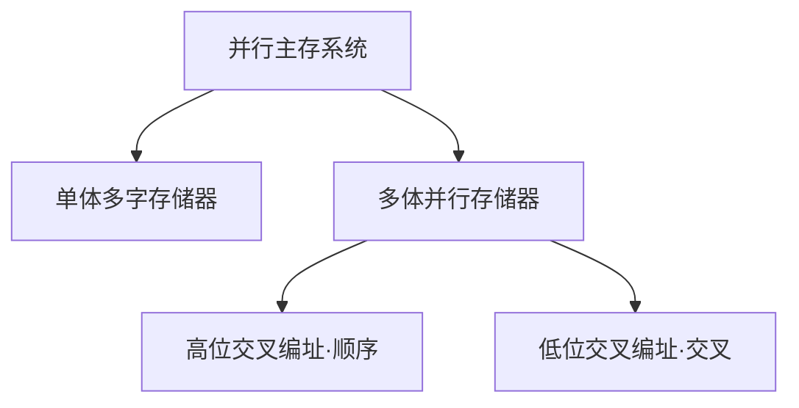

# 并行存储器

> [!abstract] 一句话
> CPU 快主存慢，带宽 = 数据宽度/存储周期（见[存储系统基本概念](存储系统基本概念.md)），于是两条路提带宽：**单体多字**把一个体做宽，一次搬一箱；**多体并行**用多个窄体——低位交叉流水线轮流传、高位交叉扩容容错。

## 分类



## 单体多字存储器

结构上只改三处：

1. **存储字长 = w × 机器字长**：一个存储单元存 w 个连续字（常考 w=4）
2. **数据总线加宽 w 倍**：一个存取周期并行送出 w 个字
3. **CPU 侧配 w 字缓冲队列**（指令预取队列），按字依次消费

理想带宽 $B_m = \dfrac{w\times\text{字长}}{T}$，顺序执行时翻 w 倍。

**关键前提**：指令/数据连续存放。第 1 条就是转移指令则后 w−1 条作废；计算题按「平均每次取 w 字真正用上几字」折算带宽。

**缺点四条**（简答高频）：① 跳转/不连续 → 利用率低；② 部分写需屏蔽/读改写控制；③ 一字出错整组 w 字重读；④ 位宽与总线宽度受工艺限制，w 不能大。

## 多体并行存储器

每个体都有**自己的一套** MAR、译码、存储矩阵、MDR、读写电路，可独立并行工作；编址方式决定连续地址落在哪。

### 高位交叉（顺序编址）

地址**高位选体、低位选体内单元**，连续地址挤在同一体内，存满一体才到下一体。

- 顺序访问**不提带宽**（地址总落在一个体）
- **利于扩容**：挂一个体地址空间顺势延长
- **容错好**：一体坏，其余体照常
- 用法：**指令、数据分放不同体** → 取指与取数并行

### 低位交叉（交叉编址）★核心

地址**低位选体、高位选体内单元**，相邻地址散到不同体；**体号 = 地址 mod m**（低 $\log_2 m$ 位）。

流水线：每隔总线周期 τ 启动下一个体，各体“忙”错开，总线每隔 τ 收一字：

```text
T = 100ns, τ = 25ns, m = T/τ = 4

体0 ├0ns启动──存取100ns──┤W0上车
体1     ├25ns启动──存取───────┤W1上车
体2          ├50ns启动──存取───────┤W2上车
体3               ├75ns启动──存取───────┤W3上车
时间 0   25  50  75  100 125 150 175 ns
                        ↑W0 ↑W1 ↑W2 ↑W3
```

**三个必背公式**：

1. 模块数条件 $m \ge T/\tau$（常取 $m = T/\tau$；轮一圈 $m\tau \ge T$ 否则流水线“追尾”）
2. 流水连读 n 字（n ≤ m）：$t = T + (n-1)\tau$
3. 串行读 n 字：$t = nT$

验算：读 4 字，流水 $100 + 3\times25 = 175$ ns，串行 $400$ ns；稳态带宽每 τ 一字，**×m**。

弱点：依赖**连续访问**，跳转打断流水；任一体故障影响所有连续访问（容错不如高位）。

## 三方案对比

| | 单体多字 | 多体高位交叉 | 多体低位交叉 |
| --- | --- | --- | --- |
| 结构 | 一个宽体 | 多体独立 | 多体流水 |
| 连续地址 | 同一单元内 | 同一体内 | **散在不同体** |
| 理想带宽 | ×w | ×1（可指令/数据分体并行） | ×m |
| 擅长 | 顺序取指 | **扩容、容错** | **提带宽** |
| 依赖 | 数据连续存放 | 访问不同体 | 访问连续地址 |

## 题型

① 给 T、τ 求 m（$m=\lceil T/\tau\rceil$）；② 求流水读 n 字时间并与串行比较；③ 给地址判断在哪个体、体内地址（高位交叉看高位、低位交叉 mod m）；④ 简答单体多字与多体交叉原理优缺点。②③是选择题高频。

## 现代延续

Cache line 填充 / DRAM **burst** 突发传输 ≈ 单体多字；DDR 多 **bank** 交错、双通道、RAID0 条带 ≈ 低位交叉。

## 自检

- [ ] 能画出单体多字结构并说出四条缺点
- [ ] 能推出低位交叉三个公式并画时空图
- [ ] 给定地址能判断高位/低位交叉下的体号

## 相关

- [存储系统基本概念](存储系统基本概念.md)
- [SRAM与DRAM](SRAM与DRAM.md)
- [Cache](Cache.md)
- [辅存](辅存.md)