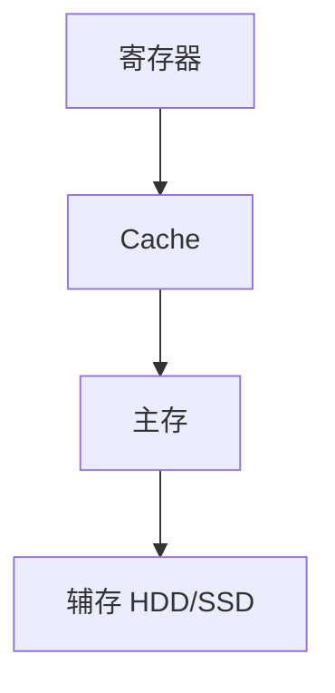

# 辅存

> [!NOTE]
> 原文仅有「磁盘 / 固态硬盘」两个标题；以下按 408 计组存储层次常见考点补充提纲。

## 定义

**辅存（辅助存储器）** 是掉电仍保持信息的大容量外存，典型为机械硬盘（HDD）与固态硬盘（SSD），在存储层次中位于主存之下。

## 磁盘（HDD）

- 结构：盘面、磁道、扇区、柱面；磁头臂寻道
- 访问时间 ≈ **寻道时间 + 旋转延迟 + 传输时间**
- 常考：平均旋转延迟 = 半圈时间；提高转速可降旋转延迟
- RAID 基础概念（条带/镜像/校验）可另开笔记

## 固态硬盘（SSD）

- 基于 Flash，无机械寻道 → 随机读延迟远低于 HDD
- 写入前通常需擦除；有磨损均衡、写放大等工程问题
- 与「主存用 DRAM、Cache 用 SRAM」对比记忆（见 [SRAM与DRAM](SRAM与DRAM.md)、[ROM与RAM](ROM与RAM.md)）

## 在存储层次中的位置

越往下：容量↑、单价↓、速度↓。

## 自检
- [ ] 能写访问时间三部分公式
- [ ] 能对比 HDD vs SSD 的延迟来源
- [ ] 能把辅存放进「寄存器-Cache-主存-辅存」层次

## 相关
- [存储系统基本概念](存储系统基本概念.md)
- [Cache](Cache.md)
- [SRAM与DRAM](SRAM与DRAM.md)
