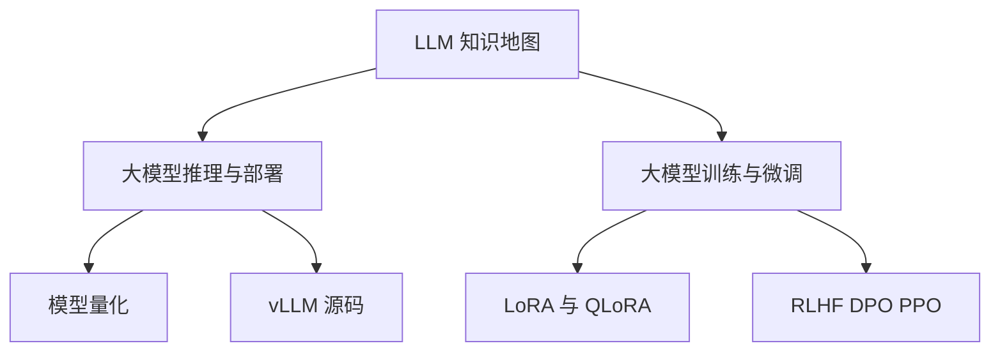

# 🗺️ LLM 知识地图(MOC)

> [!abstract] 这是什么
> 整个 `LLM/` 文件夹的总索引。一条主线串起**训练 → 推理 → 部署**全栈,从任意概念两跳内可达推导细节。新读者从这里进。

```
预训练 → SFT → 对齐 ──► 模型 ──► 量化/优化 ──► 推理服务
(训练簇)                          (推理簇)
```

---

## 🌐 两大枢纽
- [大模型推理与部署](./大模型推理与部署.md) —— 推理侧总览(9 Part,带宽主线 + 三类动作)
- [大模型训练与微调](./大模型训练与微调.md) —— 训练侧总览(预训练→SFT→对齐生命周期)

---

## 🧱 基础架构
- [Transformer 架构](./Transformer 架构.md) —— decoder-only 解剖、RMSNorm、SwiGLU、残差
- [注意力机制](./注意力机制.md) —— Scaled-Dot、MHA/GQA/MQA/MLA、RoPE/ALiBi、变体
- [Mamba 状态空间模型](./Mamba 状态空间模型.md) —— SSM/选择性扫描,常数状态无 KV

## ⚡ 推理与部署(簇 A)
- [模型量化](./模型量化.md) —— GPTQ/AWQ/SmoothQuant、FP8/INT4、KV 量化
- [长上下文推理](./长上下文推理.md) —— KV 驱逐/压缩:StreamingLLM/H2O/SnapKV/滑窗
- [采样与解码策略](./采样与解码策略.md) —— temperature/top-p/min-p、约束解码 FSM
- [投机解码进阶](./投机解码进阶.md) —— Medusa/EAGLE/Lookahead/树注意力
- [PD 分离与服务工程](./PD 分离与服务工程.md) —— disaggregation、TTFT/TPOT/goodput、SLA
- [Multi-LoRA 服务](./Multi-LoRA 服务.md) —— S-LoRA/Punica
- [vLLM 源码](./vLLM 源码.md) —— PagedAttention、调度器、Continuous Batching

## 🏋️ 训练与微调(簇 B)
- [预训练与 Scaling Law](./预训练与 Scaling Law.md) —— next-token、Chinchilla、6N
- [LoRA 与 QLoRA](./LoRA 与 QLoRA.md) —— 低秩微调、NF4、显存账
- [RLHF DPO PPO](./RLHF DPO PPO.md) —— 偏好对齐、DPO 损失推导
- [优化器与训练稳定性](./优化器与训练稳定性.md) —— AdamW、混合精度、梯度检查点
- [训练并行 FSDP ZeRO](./训练并行 FSDP ZeRO.md) —— ZeRO-1/2/3、FSDP、3D 并行

## ⚙️ 系统底层
- [CUDA 与算子优化](./CUDA 与算子优化.md) —— SM/warp、SRAM/HBM、融合、CUDA Graph
- [分布式训练与并行](./分布式训练与并行.md) —— DP/TP/PP/SP/EP/CP、AllReduce、ZeRO
- [MoE 混合专家](./MoE 混合专家.md) —— top-k 路由、容量因子、EP all-to-all

## 📝 题型精讲 + 试卷(子文件夹 `题型精讲/`、`试题/`)
> 对应期末考试,考前直接刷。
- [期末试卷与答案](./题型精讲/期末试卷与答案.md) —— ⭐ 全 24 题 markdown 版(选择/填空/解答 + 答案 + 链接)
- [KV Cache 与 FLOPs 推导](./题型精讲/KV Cache 与 FLOPs 推导.md)(Q19)
- [RoPE 数学推导](./题型精讲/RoPE 数学推导.md)(Q20)
- [FlashAttention 推导](./题型精讲/FlashAttention 推导.md)(Q21)
- [Speculative Decoding 证明](./题型精讲/Speculative Decoding 证明.md)(Q23)
- SmoothQuant 等价变换(Q22)→ [模型量化](./模型量化.md) §4.3
- 原始 PDF：[期末试卷](./试题/大模型推理与部署_期末试卷.pdf)、[参考答案](./试题/大模型推理与部署_参考答案.pdf)

## 🎨 可视化
- [思维导图](./大模型推理与部署-思维导图.excalidraw.md) —— 一页纸主线图

---

## 🧭 学习路径建议
1. **入门**:[Transformer 架构](./Transformer 架构.md) → [注意力机制](./注意力机制.md) → [大模型推理与部署](./大模型推理与部署.md)
2. **推理优化**:[模型量化](./模型量化.md) → [长上下文推理](./长上下文推理.md) → [vLLM 源码](./vLLM 源码.md) → [PD 分离与服务工程](./PD 分离与服务工程.md)
3. **训练全栈**:[预训练与 Scaling Law](./预训练与 Scaling Law.md) → [大模型训练与微调](./大模型训练与微调.md) → [RLHF DPO PPO](./RLHF DPO PPO.md) → [训练并行 FSDP ZeRO](./训练并行 FSDP ZeRO.md)
4. **考前冲刺**:`题型精讲/` 五篇推导 + 各笔记的「自检」清单

> [!cite] 试卷与答案已并入 `试题/` 子文件夹(含完整试卷 PDF + 参考答案 PDF),markdown 版见 [期末试卷与答案](./题型精讲/期末试卷与答案.md)。

## OK 导航补充

> [!TIP]
> 本页是 LLM 簇入口。链接已改为相对路径；建议从两大枢纽进入。


